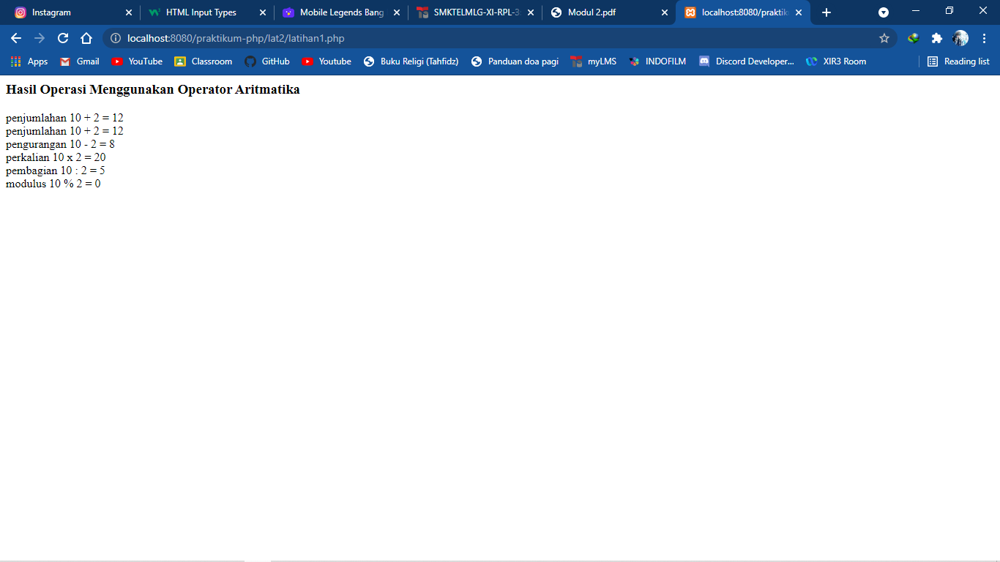
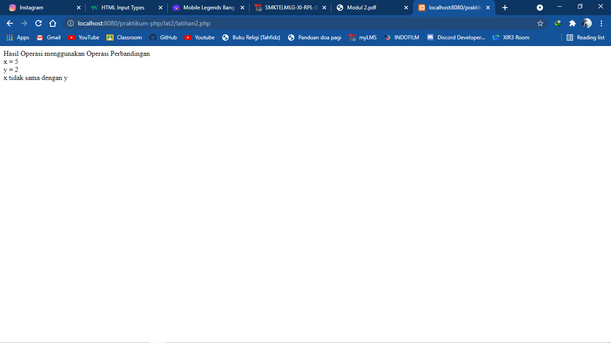
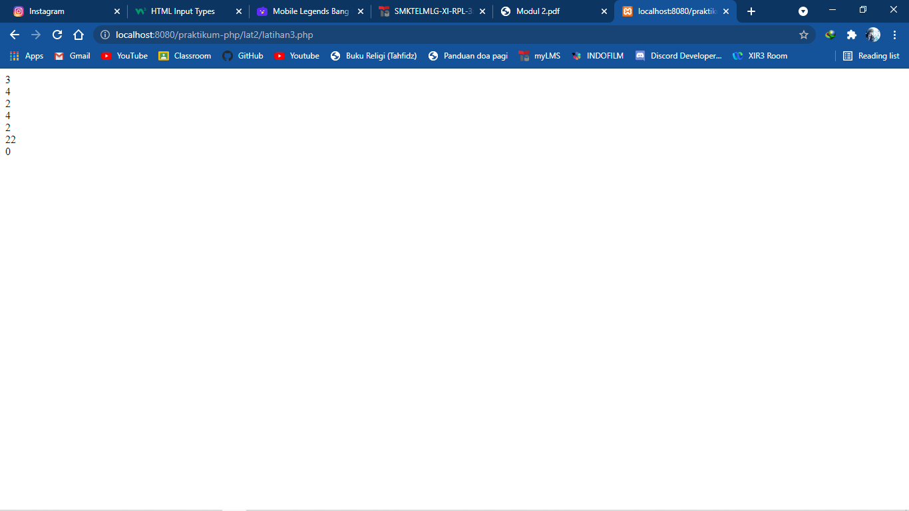
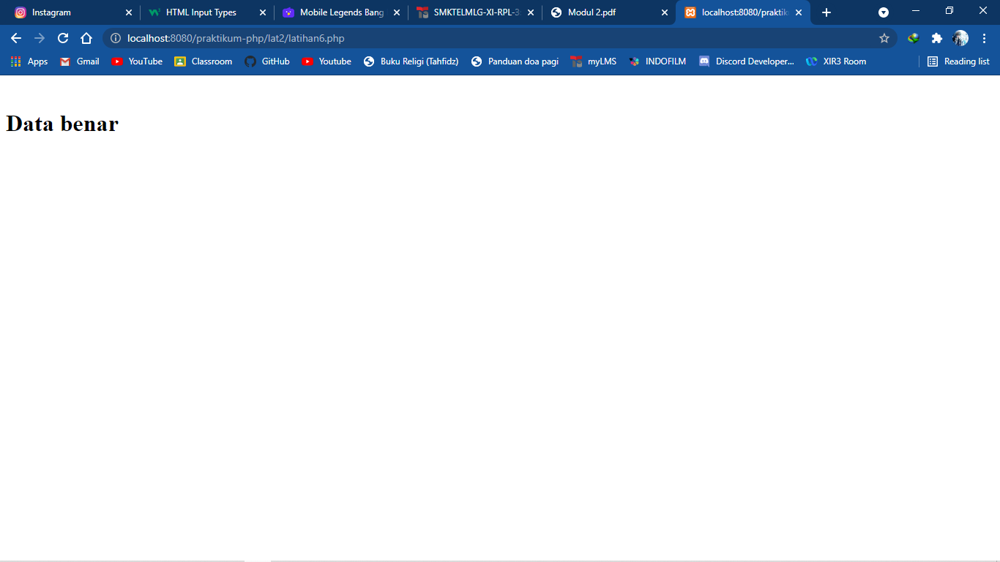
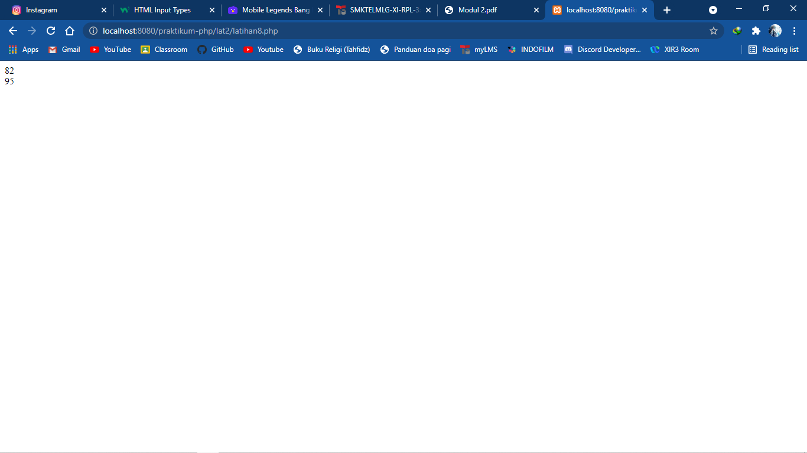
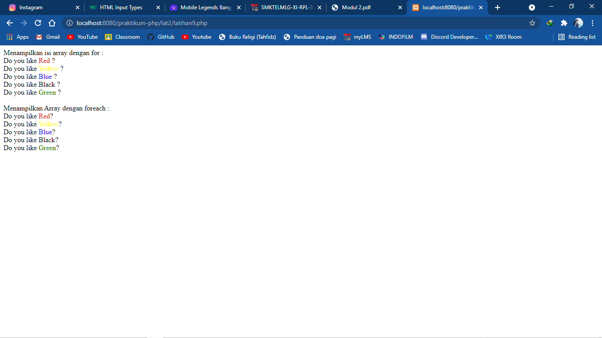
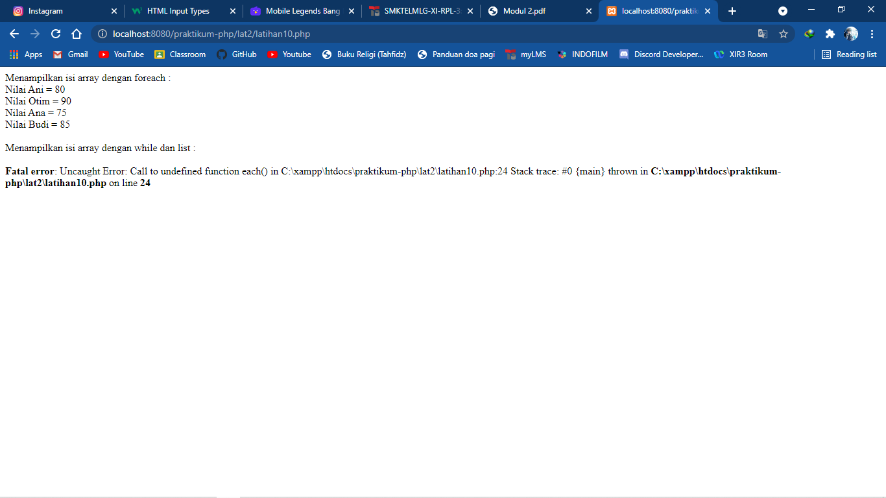

# Praktikum PHP Modul 2

<b>Operator</b> Dalam bahasa pemrograman secara umum, operator digunakan untuk
memanipulasi atau melakukan proses perhitungan pada suatu nilai. Operator yang akan
kita pelajari adalah operator aritmatik, perbandingan, gabungan aritmatik dan
assignment, serta operator logika.

<h2>Latihan 1</h2>
 
<h2>Latihan 2</h2>
 
<h2>Latihan 3</h2>
 
<h2>Latihan 4</h2>
 
<h2>Latihan 5</h2>
 
<h2>Latihan 6</h2>
 

<b>Array</b> Array merupakan tipe data terstruktur yang berguna untuk menyimpan sejumlah data yang
bertipe sama. Bagian yang menyusun array disebut elemen array. Masing-masing elemen
array dapat diakses melalui index array. Index array dapat berupa biangan integer atau
string

<h2>Latihan 7</h2>
 
<h2>Latihan 8</h2>
 
<h2>Latihan 9</h2>
 
<h2>Latihan 10</h2>
 
